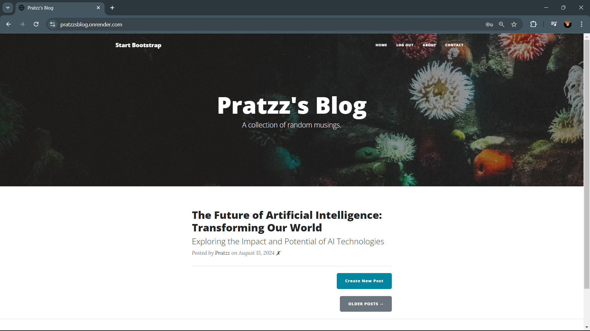
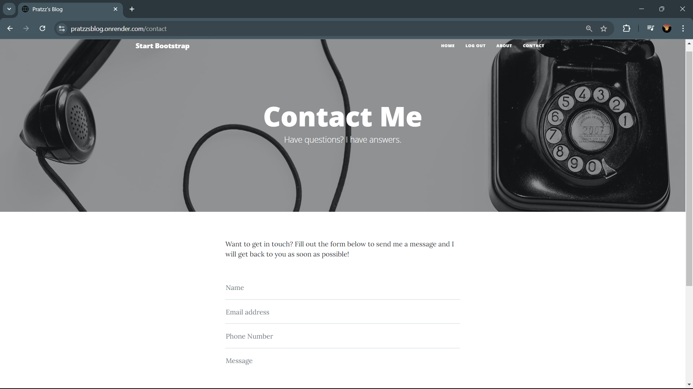
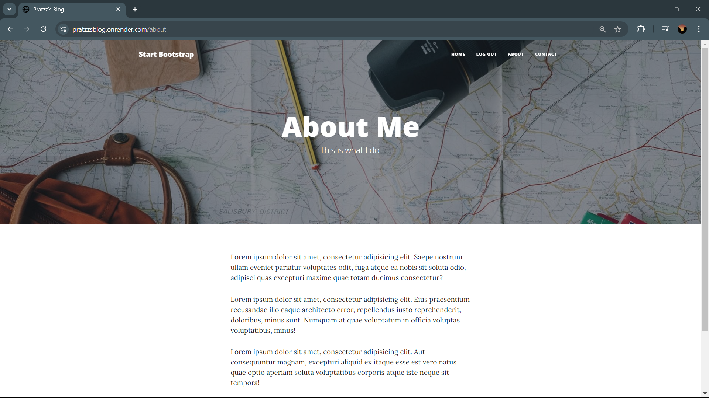

# Blog Platform for Deployment

This repository contains the code for a blog platform built using Flask, SQLAlchemy, and Bootstrap, with features such as user authentication, blog post creation, commenting, and more. The project is currently deployed at [Pratzz's Blog](https://pratzzsblog.onrender.com/).

## Features

- **User Authentication**: Users can register, log in, and log out.
- **Admin Privileges**: Only the admin user (ID: 1) can create, edit, or delete blog posts.
- **Blog Posts**: Users can create, edit, and delete their own posts. Posts include titles, subtitles, body content, and images.
- **Commenting**: Authenticated users can comment on posts.
- **Profile Images**: Gravatar is used to add profile images to comments.
- **Responsive Design**: The website is styled using Bootstrap for a responsive and clean design.

## Technology Stack

- **Backend**: Flask, SQLAlchemy
- **Frontend**: Bootstrap, Flask-Bootstrap, Flask-CKEditor
- **Authentication**: Flask-Login, Werkzeug Security
- **Database**: SQLite (can be replaced with other databases like PostgreSQL)
- **Deployment**: Render

## Installation

To run this project locally, follow these steps:

1. **Clone the repository**:
   ```bash
   git clone https://github.com/Prathamesh326/day-71-starting-files-blog-for-deployment.git
   cd day-71-starting-files-blog-for-deployment
   ```

2. **Install dependencies**:
   On Windows:
   ```bash
   python -m pip install -r requirements.txt
   ```
   On macOS/Linux:
   ```bash
   pip3 install -r requirements.txt
   ```

3. **Set environment variables**:
   - `FLASK_KEY`: Secret key for Flask session management.
   - `DB_URI`: Database URI, e.g., `sqlite:///posts.db` for SQLite.

   You can set these in a `.env` file or directly in your environment.

4. **Run the application**:
   ```bash
   python main.py
   ```

   The application will be available at `http://localhost:5001`.

## Deployment

The project is deployed on [Render](https://pratzzsblog.onrender.com/). To deploy it yourself:

1. Push your code to GitHub.
2. Create a new web service on Render.
3. Connect your GitHub repository.
4. Set environment variables for `FLASK_KEY` and `DB_URI`.
5. Deploy the service.

## Usage

- Visit the home page to view all blog posts.
- Register or log in to create a new post.
- Only the admin can edit or delete posts.
- Users can comment on posts after logging in.

## Screenshots

### Home Page


### Post Creation 


### Contact Page


### about Page



## Contributing

Contributions are welcome! Please submit a pull request or open an issue for any changes or suggestions.

## License

This project is licensed under the MIT License.

## Contact

For any queries or support, please contact [Prathamesh](pratzz326@gmail.com).
